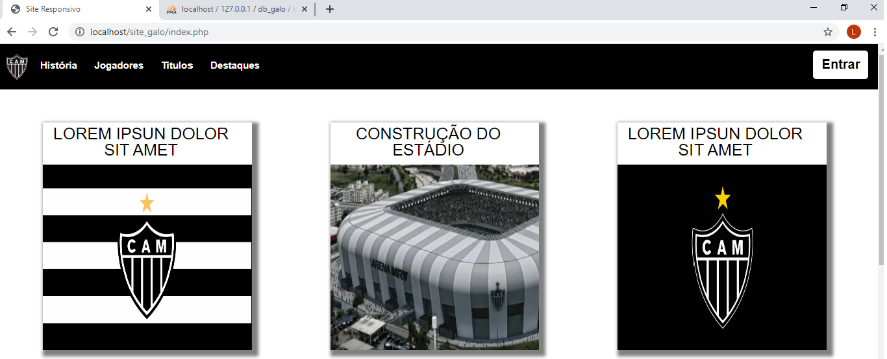

# Sistema de notícias de um clube de futebol :soccer:
 * Nesse Sistema, será postados notícias do clube podendo ser gerenciado as postagens e gerenciamento de usuários do sistema.

 ## Sobre
 * Esse App desenvolvido em PHP, utilizando um miniframework MVC, para facilitar o desenvolvimento
site, que ainda está em desenvolvimento.

###  Desenvolvimento 
*  Atualmente o sistema está em desenvolvimento.
 #### Status
 <h4 align="center"> 
	🚧  ... Galo Notícias 🚀 Em construção...  🚧
</h4>
 ## Features
- [x]  Front-end
- [x]  Sistema de Login
- [x]  integrar ao banco de dados
- [ ]  Controle de Jornalistas
- [ ]  Responsividade
- [ ]  Cadastrar,Alterar,Desativar Notícias

## Tecnologias

## License

### Telas

>>------------------------------------
* Tela de Login:

